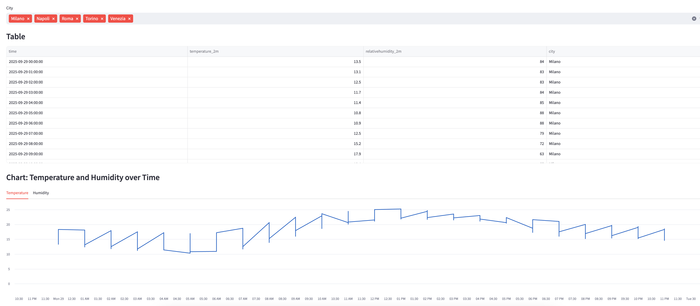

## Pipeline Example – MWAA Local Runner, dbt, Terraform e Frontend

Questo repository contiene un esempio end‑to‑end che utilizza:
- DAG airflow
- dbt
- Terraform per il provisioning in AWS (bucket S3 e utente IAM)
- Un frontend Streamlit per visualizzare i dati dal database in cloud


### Prerequisiti
- macOS con Docker Desktop installato
- Python 3.10+ (per il FE)
- Terraform >= 1.5
- Credenziali AWS configurate (profili o variabili d’ambiente)

---

## 1) DAG con AWS MWAA Local Runner (v2.10.1) + dbt

Clona  [aws/aws-mwaa-local-runner](https://github.com/aws/aws-mwaa-local-runner).

### 1.1 Build immagine e avvio Airflow
Esegui i comandi dalla cartella `aws-mwaa-local-runner/`:

```bash
cd aws-mwaa-local-runner
./mwaa-local-env build-image   # potrebbe richiedere alcuni minuti
./mwaa-local-env start         # avvia Postgres + Airflow local runner
```

- UI Airflow: `http://localhost:8080`
- Credenziali di default: user `admin`, password `test` (vedi README del progetto MWAA Local Runner: [link](https://github.com/aws/aws-mwaa-local-runner))

### 1.2 Montare il progetto dbt nel container
Nel file `aws-mwaa-local-runner/docker/docker-compose-local.yml` è stato aggiunto un volume per montare la cartella del progetto dbt dentro il container, ad esempio:

```yaml
      - /percorso/assoluto/al/progetto/dbt/openmeteo:/usr/local/airflow/dbt
```

Nota: nel repository attuale la riga è impostata su un percorso assoluto d’esempio. Aggiorna la riga del volume per puntare alla tua cartella dbt locale (consigliato usare il progetto in `dbt/openmeteo/` di questo repo). Dopo la modifica, riavvia il local runner.

### 1.3 Installare dbt nell’ambiente Airflow
Opzione consigliata: aggiungere i pacchetti dbt al file `aws-mwaa-local-runner/requirements/requirements.txt`, poi rieseguire `./mwaa-local-env build-image` e `start`.

Esempio (adatta versioni e adapter):
```text
dbt-core==1.7.9
dbt-postgres==1.7.9
```

### 1.4 Dove mettere DAG e requirements
- Inserisci i DAG in `aws-mwaa-local-runner/dags/` (o in `dags/` alla root, se già montato nel compose)
- Le dipendenze Python di Airflow vanno in `aws-mwaa-local-runner/requirements/requirements.txt`

---

## 2) Database in cloud e bucket S3 con Terraform

Il database è ospitato in cloud su AWS. Questo repo include una cartella `terraform/` con esempi per creare un bucket S3 e un utente IAM con policy minima per quel bucket.

Output attesi: bucket S3 creato, utente IAM e chiavi di accesso associate, policy con permessi su quel bucket. Utilizza le credenziali generate solo per lo scopo previsto e conservale in modo sicuro.

Se devi caricare artefatti (es. file dbt, requirements, dati), utilizza il bucket S3 creato da Terraform.

---

## 3) Frontend (FE) Streamlit

Il frontend si trova in `FE/` e mostra i dati trasformati leggendo direttamente dal database in cloud.

### 3.1 Variabili d’ambiente richieste
Il file `FE/app.py` legge la connessione dal seguente set di variabili (anche via `.env`):

```bash
DB_HOST=...
DB_PORT=5432
DB_NAME=...
DB_USER=...
DB_PASS=...
```

Crea un file `FE/.env` con questi valori o esportali nel tuo shell.

### 3.2 Installazione dipendenze e avvio
```bash
cd FE
python -m venv .venv && source .venv/bin/activate
pip install -r requirements.txt
streamlit run app.py
```

Apri il browser all’indirizzo indicato da Streamlit (tipicamente `http://localhost:8501`). Se la connessione al DB fallisce, verifica le variabili in `.env` e la raggiungibilità del database.

### 3.3 Screenshot UI


---

## 4) Struttura del repository (parziale)

```
aws-mwaa-local-runner/
  dags/                # DAG Airflow
  docker/              # config + docker-compose
  requirements/        # requirements Airflow
dbt/
  openmeteo/           # progetto dbt
FE/
  app.py               # Streamlit FE
  requirements.txt
terraform/
  main.tf              # esempio bucket S3 + utente IAM
```

---

